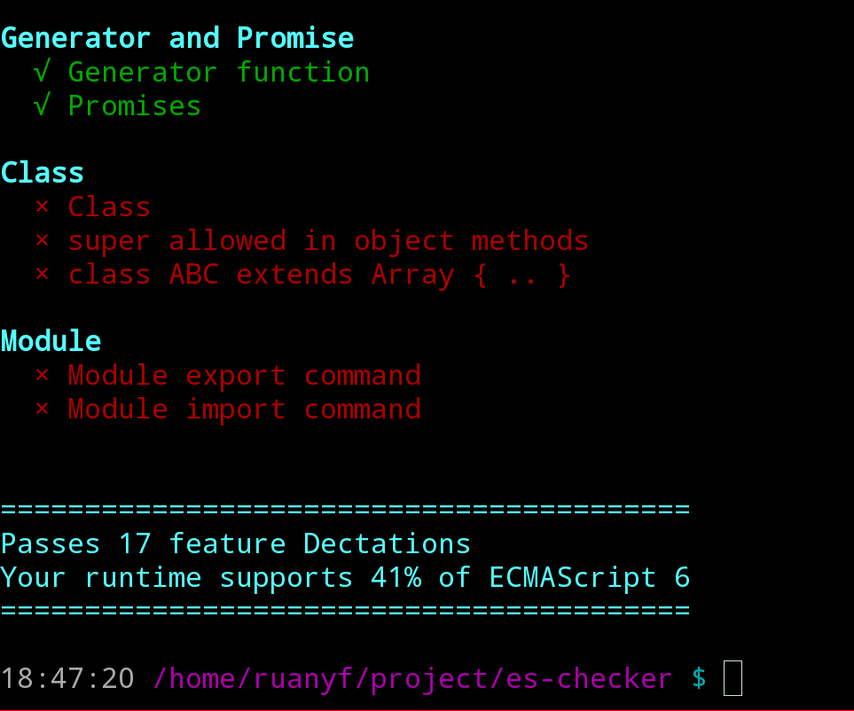

ES-Checker is a feature detection library for ECMAScript in node.js and browser. Please visit [demo](http://ruanyf.github.io/es-checker/).

## How to use

### Command line

```bash
$ npm install -g es-checker
$ es-checker
```



### Node.js

First install es-checker locally.

```bash
$ npm install --save es-checker
```

Then require it in your script.

```javascript
var Supports = require("es-checker");

if (Supports.letConst) {
  let x = 5;
} else {
  var x = 5;
}
```

The whole Api List please [see below](#api).

### Browser

First insert es-checker.js into your page.

```html
<script src="http://ruanyf.github.io/es-checker/es-checker.js"></script>
```

Then use `Supports` to decide which feature to use. Visit [demo](http://ruanyf.github.io/es-checker/).

```html
<script>
if (Supports.letConst) {
  let x = 5;
} else {
  var x = 5;
}
</script>
```

The whole API List please [see below](#api).

## API

This library is derived from [es-feature-tests](https://github.com/getify/es-feature-tests). The following API is copied from it. Visit [FeatureTests.io](https://featuretests.io/details) for more information, including how to test a feature by yourself.

- **letConst**: let and const
- **defaultParameter**: default function parameter values
- **spreadRest**: ... operator
- **destructuring**: destructuring assignments/declarations for arrays and objects
- **parameterDestructuring**: destructuring for function parameters
- **templateString**: `..` Template String Literals
- **forOf**: for (var v of something) { .. }
- **arrow**: x => x * x
- **generator**: function *foo() { .. }
- **conciseMethodProperty**: o = { b() { .. }, a }
- **computedProperty**: o = { ["a" + "b"]: 42 }
- **moduleExport**: In modules, export default foo = 42
- **moduleImport**: In modules, import bar from "foo"
- **class**: class A extends B { .. }
- **numericLiteral**: Octal and binary literal forms (0o1, 0b10)
- **oldOctalLiteral**: Old octal literal invalid now (01)
- **symbol**: Symbol primitive
- **unicodeEscape**: Unicode code-point escape form in string literals ('\u{20BB7}')
- **unicodeIdentifier**: Unicode code-point escape form in identifier names (\u{20BB7} = 42)
- **unicodeRegExp**: Unicode code-point escape form in regular expressions (/\u{20BB7}/u)
- **stickyRegExp**: y flag for sticky regular expressions
- **letTDZ**: TDZ error for too-early access of let or const declarations
- **constRedef**: Redefinition of const declarations not allowed
- **objectProto**: __proto__ in object literal definition sets [[Prototype]] link
- **objectSuper**: super allowed in object methods
- **extendNatives**: class ABC extends Array { .. }
- **tco**: Tail-call optimization for function calls and recursion
- **symbolImplicitCoercion**: Symbols can't be implicitly coerced (Symbol("a") + "")
- **functionNameInfernece**: Inferences for function name property for anonymous functions
- **objectStatics**: Static functions added to Object
- **arrayStatics**: Static functions added to Array
- **arrayMethods**: Methods added to Array.prototype
- **typedArrays**: TypedArrays like Uint8Array (technically a web platform feature long before ES6)
- **typedArrayStatics**: Some Array statics (like from(..)) added to the TypedArray constructors
- **typedArrayMethods**: Some Array methods (like map(..)) added to the TypedArray prototypes
- **stringMethods**: Methods added to String.prototype
- **numberStatics**: Static functions added to Number
- **mathStatics**: Static functions added to Math
- **collections**: Collections added (Map, Set, WeakMap, WeakSet)
- **proxy**: Proxies
- **promise**: Promises
- **reflect**: Reflect

## Licensed

MIT
